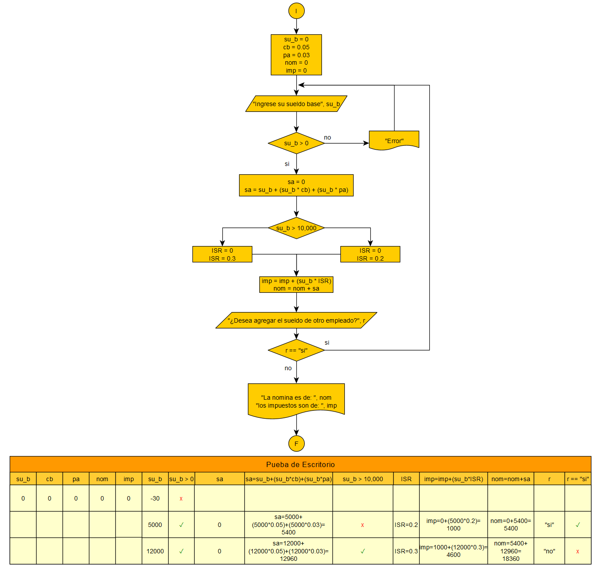

## Una empresa desea calcular el sueldo total de una persona bajo los siguientes rubros;
### Percepciones: Sueldo base, 5% de canasta basica y 3% de prima de antiguedad  
### Reducciones: Si el sueldo base excede los 10,000 pesos, el ISR será del 30%,  menos de esta cantidad, hará que el ISR sea de el 20%

### ***Indique cuanto es de la nomina, y cuanto el patrón debe pagar al SAT***
